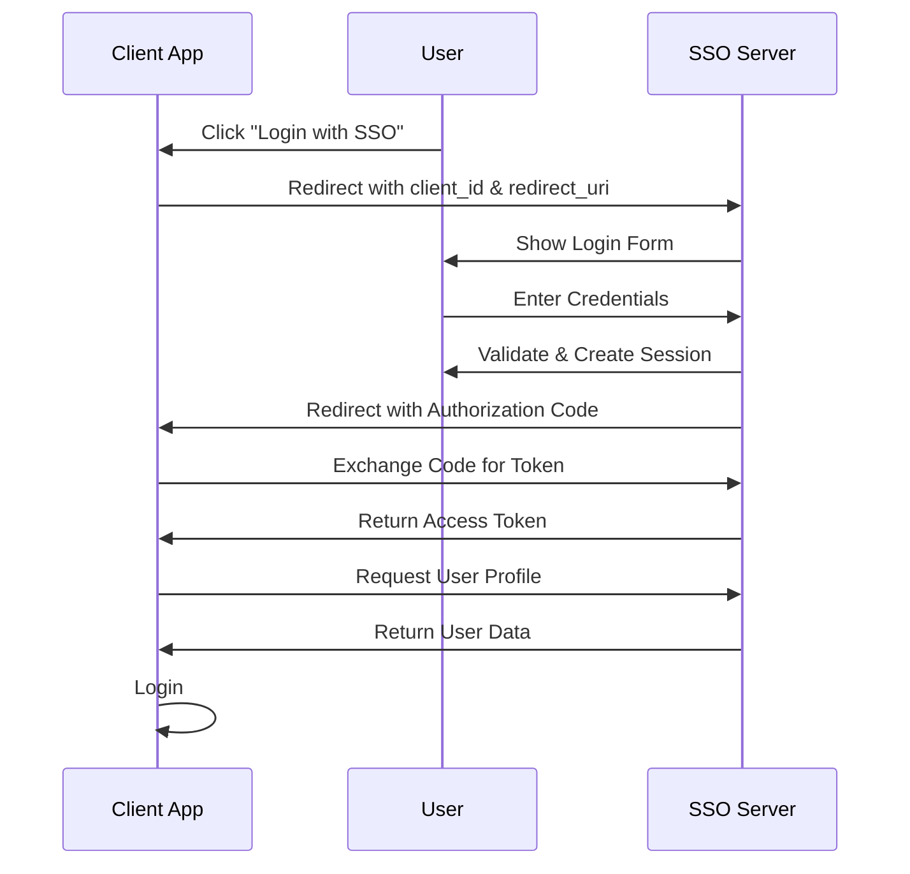

# SSO Project Documentation

## Architecture Overview

This project implements a centralized Single Sign-On (SSO) system using Laravel Passport. The architecture consists of three main components:


### Simple Box Diagram

```
┌──────────────────────┐
│      SSO Server      │
│   (Passport OAuth2)  │
└──────────┬───────────┘
           │
     ┌─────┴─────┐
     │           │
     ▼           ▼
┌─────────┐  ┌────────────┐
│Ecommerce│  │ Foodpanda  │
│   App   │  │    App     │
│         │  │            │
└─────────┘  └────────────┘

```

---

### OAuth2 Flow



## Project Structure

```
task-one/
├── sso-server/          # Central OAuth2 authentication server
├── ecommerce-app/       # E-commerce client application
├── foodpanda-app/       # Food ordering client application
└── README.md            # This documentation
```

---

## Prerequisites

- PHP 8.4+
- Composer
- Laravel Herd (for local development)
- SQLite (default database)

---

## Setup Guide

### Step 1: Setup SSO Server

The SSO Server acts as the centralized authentication provider using Laravel Passport.

#### 1.1 Install Dependencies

```bash
cd sso-server
composer install
```

#### 1.2 Configure Environment

```bash
cp .env.example .env
```

Edit `.env` file:

```env
APP_NAME=SSO Server
APP_URL=https://sso-server.test
```

#### 1.3 Generate Application Key

```bash
php artisan key:generate
```

#### 1.4 Run Migrations

```bash
php artisan migrate
```

#### 1.5 Install Passport Keys

```bash
php artisan passport:keys
```

#### 1.6 Create OAuth Clients

For each client application, create an OAuth client:

```bash
php artisan passport:client
```

When prompted:

```
What should we name the client? [Ecommerce App]:
> ecommerce-client

Enter the redirect URI [http://localhost]:
> https://ecommerce-app.test/callback
```

This will output:
```
Personal access client created successfully.
Client ID: <uuid>
Client Secret: <random-string>
```

**Repeat this command for each client app** (Ecommerce App, Foodpanda App).

#### 1.7 Start SSO Server

The SSO server is served by Laravel Herd at: https://sso-server.test

---

### Step 2: Setup Client Applications

Both `ecommerce-app` and `foodpanda-app` follow the same setup process.

#### 2.1 Install Dependencies

```bash
# For Ecommerce App
cd ecommerce-app
composer install

# For Foodpanda App
cd foodpanda-app
composer install
```

#### 2.2 Configure Environment

```bash
# Ecommerce App
cd ecommerce-app
cp .env.example .env

# Foodpanda App
cd foodpanda-app
cp .env.example .env
```

#### 2.3 Generate Application Key

```bash
# Ecommerce App
php artisan key:generate

# Foodpanda App
php artisan key:generate
```

#### 2.4 Run Migrations

```bash
# Ecommerce App
php artisan migrate

# Foodpanda App
php artisan migrate
```

---

### Step 3: Configure SSO Credentials

#### 3.1 Copy Credentials from SSO Server

After creating OAuth clients in Step 1.6, you will have:

| App | Client ID | Client Secret | Redirect URI |
|-----|-----------|---------------|--------------|
| ecommerce-client | `019ce042-82ed-73cb-911a-6ca938a8f2c6` | `nPRniOqxRhtnhJYTkgdHpRJ21SgvQagkJch8Q4mk` | `https://ecommerce-app.test/callback` |
| foodpanda-client | `019ce053-0c28-700b-8a0c-10d9ee6ff0f2` | `UrAFWYhpzRGhcoht5qDZKj1bLNyFJ3LUxYaSpaP5` | `http://foodpanda-app.test/callback` |

#### 3.2 Update .env Files

**For ecommerce-app/.env:**

```env
# SSO Configuration
SSO_SERVER=https://sso-server.test
SSO_CLIENT_ID=019ce042-82ed-73cb-911a-6ca938a8f2c6
SSO_CLIENT_SECRET=nPRniOqxRhtnhJYTkgdHpRJ21SgvQagkJch8Q4mk
SSO_REDIRECT_URI=https://ecommerce-app.test/callback
```

**For foodpanda-app/.env:**

```env
# SSO Configuration
SSO_SERVER=https://sso-server.test
SSO_CLIENT_ID=019ce053-0c28-700b-8a0c-10d9ee6ff0f2
SSO_CLIENT_SECRET=UrAFWYhpzRGhcoht5qDZKj1bLNyFJ3LUxYaSpaP5
SSO_REDIRECT_URI=http://foodpanda-app.test/callback
```

#### 3.3 Clear Config Cache

```bash
# Ecommerce App
php artisan config:clear

# Foodpanda App
php artisan config:clear
```

---

## How SSO Works

### Client-Side Implementation

Each client application has an `SSOController` with two main methods:

#### 1. Redirect to SSO Server

```php
public function redirectToSSO(Request $request)
{
    $state = Str::random(40);
    session(['state' => $state]);

    $query = http_build_query([
        'client_id' => config('app.sso_client_id'),
        'redirect_uri' => config('app.sso_redirect_uri'),
        'response_type' => 'code',
        'scope' => '',
        'state' => $state
    ]);

    return redirect(config('app.sso_server') . '/oauth/authorize?' . $query);
}
```

#### 2. Handle Callback

```php
public function callback(Request $request)
{
    // Validate state
    if ($request->state != session('state')) {
        abort(403);
    }

    // Exchange authorization code for access token
    $response = Http::asForm()->post(config('app.sso_server') . '/oauth/token', [
        'grant_type' => 'authorization_code',
        'client_id' => config('app.sso_client_id'),
        'client_secret' => config('app.sso_client_secret'),
        'redirect_uri' => config('app.sso_redirect_uri'),
        'code' => $request->code
    ]);

    $token = $response->json();

    // Get user profile from SSO server
    $userResponse = Http::withToken($token['access_token'])
        ->get(config('app.sso_server') . '/api/user');

    $ssoUser = $userResponse->json();

    // Create or update local user
    $user = User::updateOrCreate(
        ['email' => $ssoUser['email']],
        [
            'name' => $ssoUser['name'],
            'password' => bcrypt(Str::random(16))
        ]
    );

    Auth::login($user);
    return redirect()->route('dashboard');
}
```

---

## Routes

### SSO Server Routes

| Method | URI | Description |
|--------|-----|-------------|
| GET | `/` | Welcome page |
| GET | `/login` | Login page |
| GET | `/register` | Registration page |
| GET | `/oauth/authorize` | OAuth authorization endpoint |
| POST | `/oauth/token` | OAuth token endpoint |
| GET | `/api/user` | Get authenticated user (API) |
| POST | `/api/logout` | Logout (API) |
| GET | `/dashboard` | User dashboard |

### Client Application Routes

| Method | URI | Description |
|--------|-----|-------------|
| GET | `/` | Welcome page |
| GET | `/login` | Login page (redirects to SSO) |
| GET | `/callback` | SSO callback handler |
| GET | `/dashboard` | Protected dashboard |

---

## Troubleshooting

### Common Issues

1. **Invalid Client Credentials**
   - Ensure `SSO_CLIENT_ID` and `SSO_CLIENT_SECRET` match the values from the SSO server
   - Run `php artisan config:clear` after updating `.env`

2. **Redirect URI Mismatch**
   - Ensure `SSO_REDIRECT_URI` exactly matches what's registered in the SSO server

3. **SSL Certificate Errors**
   - If using HTTPS locally, ensure Laravel Herd is properly configured

4. **Database Errors**
   - Run migrations on all three applications
   - Check SQLite database files exist in `database/database.sqlite`

### Testing SSO

1. Start all three applications via Laravel Herd
2. Visit `https://ecommerce-app.test` or `http://foodpanda-app.test`
3. Click "Login" - you should be redirected to the SSO server
4. Register or login on the SSO server
5. After successful authentication, you should be redirected back to the client app
6. You should now be logged in to the client application

---

## Security Notes

- Keep `SSO_CLIENT_SECRET` confidential
- Use HTTPS in production
- The `state` parameter prevents CSRF attacks
- Access tokens should be stored securely (session in this implementation)
